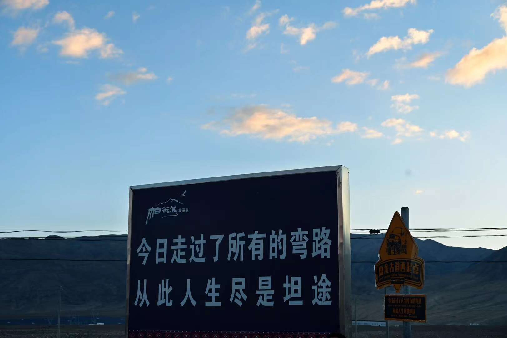

2023年或许是我人生中最重要的一年，校招、毕设等等。作为学生阶段的最后一年，我给2023年的关键词是“痛苦中成长”。

## 2023 流水账

1月份在家刷题，背八股。由于12月份的高强度论文写作，论文的相关工作基本上都完成了，所以有了大量空闲的时间准备春招实习。很多人都会觉得八股没有意义，属于应试，我个人也很反感这种考察方式。但背了很多八股后，有了一种顿悟的感觉。在实际的工作中，八股的东西其实并不会用到多少，有多少人的工作会涉及到操作系统的分页分段呢？大家斗不过是各种形式的CRUD boy罢了。但当我们需要排查bug，亦或是追求极致的代码性能时，就需要充分了解各种底层系统的原理。八股无疑是一种高效的方式，即使我们无法一直记得其中的细节，但八股背多了，总会有一种sense，让我们知道该朝哪个方向去解决问题。

2月份正式开始了春招。今年特别离谱的是阿里云，每个部门都自己抢跑，在系统外面试。经历了各家公司，各种大佬的拷打之后，也是侥幸拿到了几个offer。

3月份完成了论文的重投，也顺利拿到了一个自己理想的offer。时隔3年，重回阿里。

4月份趁实验室投稿结束放假，体验了一波量化。虽然只做了一些边边角角的工作，估计也没有什么人会用到，但是确实体验了一波高性能计算，算是开启了我的量化之路。

5月份享受生活。去了漫展、迪士尼，吃了小大董、西塔。还上了私教课，困扰多年的驼背有所缓解了，但不幸的是人生第一次阳了，新冠无法逃脱。

6月份开始了暑期实习。我也算实习经历很丰富了，这次实习确实是感觉最硬核的一次，也更加认定了自己对鸡架的热爱。还有一个最大的好消息，人生中第一篇a会终于中了，也有自己的google scholar了哈哈。

7月份发生了很多事情。先是一段糊里糊涂的感情结束了，然后继续自己的学术之路，去重庆的ChinaVis上做了学术汇报。突然意识到了自己的成长，以前在几十个人之前演讲都会紧张，现在在几百人的会场汇报也没有感觉。从前的小孩也长大了。

8月份在实习生代码大赛侥幸拿到一个铜奖。现在提起这个比赛真的是可笑，充分体现了我司的ppt画饼能力。说好的秋招直通卡，结果冠军那一组一个转正失败，两个跑路，全都没留下来。同时，一边还在秋招。和春招相比，我的秋招简直是太失败了。被宇宙厂挂了5次。。20年离开之后没想到竟然回不去了。。

9月份转正结束，重新换了个地方开始量化之路。算是从鸡架重回业务了。

10月份去了新疆。每天开车开5 600公里，一路从乌鲁木齐开到了中国最西边。无论去多少次，新疆都真的太美了。

11月份去看了五月天的演唱会。现场真的很嗨，感觉自己是个e人。结果回来一看，各种假唱。。。

12月份转正结果终于出来了，签了三方，人生的第一份工作选择了人生第一份实习的地方。虽然量化给我开了离谱的薪资，但最后还是选择了云。希望过几年之后，还有机会重回量化吧，WLB还是很香的。同时，交了毕业论文。研究生生涯进入了倒计时。

总的来说，2023年我遇到了很多新人，体验了很多没有体验过的事情。虽然这一年经历很多痛苦的事情，非常焦虑，找工作、写毕设、感情折磨，精神状态一直不太稳定，但这一年真的成长了很多。这种成长不仅仅是技能上的成长，更多的是拥有了一个更稳定的内核。年初的投稿锻炼了我的逻辑表达能力，年中的感情锻炼了我的情绪稳定，整年的面试锻炼了我对自己的认知能力。

## 2024 展望

2024年是我从学生到打工人转变的一年。虽然从大三实习开始，就已经逐步接触社会了，但还是希望在2024年能够彻底地完成身份的转变。

### 可观测

作为自己未来的工作方向，我对这块的理解还是比较浅薄。同时作为一个新兴的领域，可观测相关的教程并不是十分完善。因此，2024年希望能够对这一领域进行一些深入系统地学习，成为可观测领域的小小专家。

### 高性能计算

我个人目前的职业规划是互联网卷几年后，逐步回归量化。所以，还是需要在平时的工作和学习中关注一些与量化有交集的地方。高性能计算就是其中一个，也是我比较感兴趣的方向。

### 自媒体

过去几年一直尝试去做自媒体，希望在自己学习知识的同时，把学习到的东西分享给大家。由于学校里导师太过于压榨，一直没能WLB。希望在工作之后，能够正式地开始自己的自媒体计划。

最后，以盘龙古道上的一句话来结尾，2024年见！

————写于2024年2月9日大年三十

