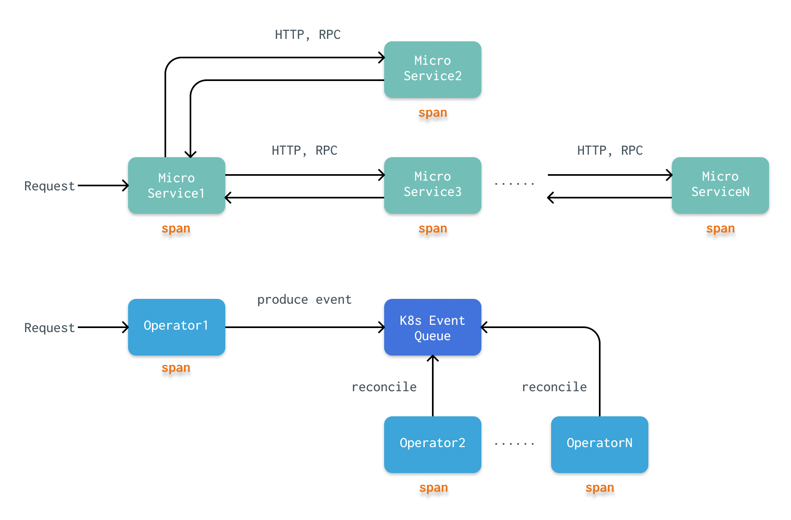
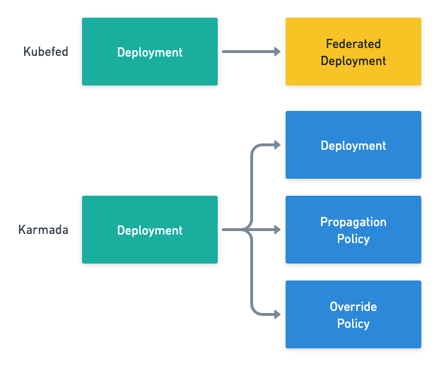
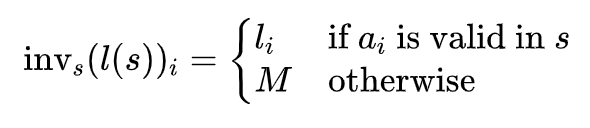
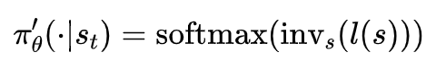
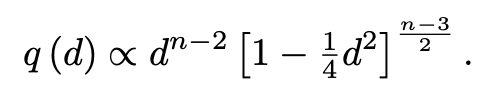
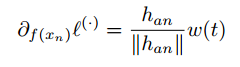
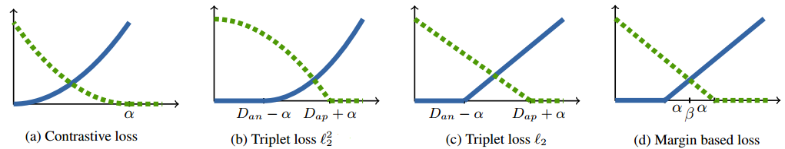

每期 Awesome Tech Post 都会摘录推荐 5 篇优质技术博客，对这些文章的内容进行提炼总结。每期覆盖领域各不相同，可能从后端到可视化，从工程到算法等等，但每篇文章都会对领域内的某一问题进行深入分析或提出独到见解。欢迎大家私信推荐文章~

## TL;DR

本期内容：

1. 如何对 Kubernetes Operator 进行分布式 Tracing `Cloud`

2. Kubernetes 多集群管理与联邦 `Cloud`

3. 强化学习中对无效动作的 mask `Reinforcement Learning`

4. 一些深度学习中的采样方式和损失函数 `Deep Learning`

5. 如何在一个全新的领域开展学习 `Soft Skill`

## 0. How to Monitor Kubernetes Operators By Distributed-Tracing?

原文链接：[https://yue9944882.github.io/posts/how-to-monitor-kubernetes-operator-by-distributed-tracing/](https://yue9944882.github.io/posts/how-to-monitor-kubernetes-operator-by-distributed-tracing/)

在一个健全的系统中，应当对一条请求在完整生命周期中完成了哪些处理都进行监控追踪。随着现在大量的分布式应用和微服务的落地，一条请求可能跨越多个服务，甚至集群。对于这类请求的 tracing（追踪）问题就是 distributed tracing。Tracing 的整个流程可以被建模成一个树，其中每个节点是请求所经过的处理（根据监控的粒度，可以是一个服务，也可以是一个函数）。请求经过的每个处理被称作为 span。

### 异步问题

在微服务中，一条请求 R 到达微服务1后，一般通过 HTTP 或 RPC，进一步请求到微服务2进行处理，再到微服务N。最后，沿着这一条链，进行反向的返回 response。显然，这是一个同步的过程，我们可以很清晰的看出 R 的处理流程，R 的 tracing 结果就是这条转发树。

然而，与微服务不同，k8s operator 采用了完全不同的协作模式。K8s operator 不会与其他 operator 直接进行交互，而是生成一个 Event（例如，创建一个 Pod），k8s 会将这个 Event 放入到一个队列中。所有的 operator 都不断地轮询，从这个队列中获取符合自己过滤条件的 Event。显然，这是一个异步的过程。一异步，问题就麻烦了：

1. Event 的生成/消费不是线性的
   
   Event 的生成和消费不是一一对应的。一方面，operator 可能将多个 Event 合并成一个任务，或者将一个 Event 分成多个任务。另一方面，一个任务由于重试策略可能会执行多次（在一个 operator 上产生多个 span）。

2. Event 循环
   
   当一个 operator 根据 Event 改变 k8s 的资源后，又会产生一个新的 Event（k8s 中有资源被改变）。这就提出了一个问题，什么是这次 tracing 的结束？详细的讨论可以参考原文。

### Operator 分类

每个 operator 都可能监听一个主要的 resource 和多个次要的 resource，因此，可以对 operator 进行如下的分类：

1. Type A：operator 只接收 Event。

2. Type B：operator 接收 Event，对 k8s 外的系统进行操作。

3. Type C：operator 只修改自己监听的资源。

4. Type D：operator 只修改不被自己监听的资源。

5. Type E：operator 修改任意的资源（Type C + Type D）。

对于 Type A 和 Type B 来说，请求到他们这里就结束了，所以他们是 leaf span。

对于 Type C 和 Type D 来说，由于不能确定有没有其他 operator 在监听同一个资源，所以无法判断其是否是 leaf span。对于 Type C 可以肯定的是，在 operator 完成最后一次 write 的时候，他仍会收到一个 Event（因为它所修改的资源正是自己监听的资源），并且会 drop 这个 Event（这个 Event 是由自身修改产生的，无意义）。因此，我们可以确定这个 operator 上多次 span 的 parent/child 关系。而对于 Type D，无法收到修改资源的最后一次 write 的 Event，所以，我们只能建立这个 operator 上多次 span 之间较弱的 link 关系。

对于 Type E 来说，这是最复杂但又是最常见的类型。Type E 其实是 Type C 和 Type D 的组合，所以对于 Type E 操作的每个资源，我们可以按照资源的类型，将 Type E 当前的 span 暂时转换成 Type C 或 Type D 来处理。

## 1. Kubernetes、集群联邦和资源分发

原文链接：[https://draveness.me/kuberentes-federation/](https://draveness.me/kuberentes-federation/)

Kubernetes 目前最多可以支持管理 5000 个节点，对于超过 5000 个节点的集群管理，就需要寻找其他方法对多个 K8s 集群进行管理。多集群其实不是一个新的概念，在很久之前，就在业界看到过 Mesos + K8s 的多集群管理方法。但是，多集群中的每个集群都相对独立，彼此之间没有联系，每个服务都是独立的运行在一个集群里的。而集群联邦则是在此基础上增加了两个重要的功能：跨集群的服务发现和跨集群的调度，使得一个多应用服务可以运行在多个集群上，进一步提升了服务的稳定性和可用性。

文章中，作者以两个比较出名的集群联邦项目为例，介绍了目前集群联邦的方案：

1. **Kubefed** 会为每个原生资源（e.g. Deployment）生成对应的联邦资源（e.g. FederatedDeployment）作为管理。联邦资源中会包含 Template（资源信息）、Placement（所需部署的集群）和 Overrides（同步资源到集群时，需要覆写的属性）三个部分。在分发到下游集群时，Kubefed 再根据联邦资源生成具体的原生资源。

2. **Karmada** 是 Kubefed 项目的延续，其中的概念也几乎全盘继承自 Kubefed。稍有不同的是，Karmada 保留了原生资源，并将 Kubefed 中联邦资源的 Placement 和 Override 抽离了出来，作为两个新的自定义资源 PropagationPolicy 和 OverriderPolicy。

<figure>

<figcaption align = "center">图片来自原文</figcaption>
</figure>

对于任务调度来说，文章中提到了“因为上下文的不足，集群联邦不需要也没有办法保证调度的全局最优解，而提供跨集群的部署和故障转移就已经可以满足常见的需求了”。

## 2. A Closer Look at Invalid Action Masking in Policy Gradient Algorithms

原文链接：[https://costa.sh/blog-a-closer-look-at-invalid-action-masking-in-policy-gradient-algorithms.html](https://costa.sh/blog-a-closer-look-at-invalid-action-masking-in-policy-gradient-algorithms.html)

本篇文章是作者对所发表的同名论文 [https://arxiv.org/abs/2006.14171](https://arxiv.org/abs/2006.14171) 的介绍。对强化学习稍微有所了解的同学应该都知道 Policy Gradient，属于强化学习的两大分类之一。而 Invalid Action（无效动作）是强化学习中经常遇到的问题，例如，在训练模型走迷宫时，前方有障碍物，那么前进这一动作就是 invalid 的。那么，在训练时，需要对模型过滤掉这类动作，也就是 masking。而本篇文章就在尝试解释 Policy Gradient 算法中 invalid action masking 的工作原理。虽然 masking 在很多论文里都用到了，但都只是一句话带过（我之前读到的几篇甚至不会提到这些细节），没有对 masking 的原理进行深入探索。这也是文章作者的 motivition 之一。

简单来说，invalid action masking 就是在模型根据概率采样动作时，采用一个 mask 将 invalid action 的概率置为 0。文章中作者将 invalid action masking 建模成以下的函数 \\(inv_s\\)：

\\(l(s)\\) 是状态 \\(s\\) 的 log 值。\\(inv_s\\) 在两种情况下都是可微的，在常数 \\(M\\) 时，梯度为0，因此，反向传播时不会更新模型有关 invalid action 相关的参数。

policy 在采样时的概率为：

文章中还通过量化的实验结果来验证 invalid action masking 的有效性，详情可以阅读原文。

## 3. 深度学习新的采样方式和损失函数--论文笔记

原文链接：[https://zhuanlan.zhihu.com/p/27748177](https://zhuanlan.zhihu.com/p/27748177)

本篇文章是对论文《Sampling matters in deep embedding learning》[https://arxiv.org/pdf/1706.07567.pdf](https://arxiv.org/pdf/1706.07567.pdf) 的概述。论文主要解决的是 deep embedding learning 中的采样问题和损失函数问题。文章对论文的主要内容进行了很好的概述，这里就不再赘述了，就简单的罗列一些 insight 和文章中没解释清楚的部分：

1. Triplet loss 优于 Contrastive loss 的原因有两点：
   
   1. constrative loss 假设所有样本都符合相同分布，而 triplet loss 没有这个假设。因此，可以适应各种空间形状，一定程度上能够抵御噪声的影响
   
   2. triplet loss 优化的目标是正负样本之间的相对距离差，即正样本之间的距离小于正负样本之间的距离。而 constrative loss 优化的目标是绝对距离，即所有的正样本之间的距离也要尽可能小。这是没有必要的。

2. 假设负样本均匀分布，我们也均匀随机采样。那么，采样的负样本 pairwise distance 符合如下的分布：
   
   

   
   

   
   换句话说，在高维空间里，采样得到的负样本 pairwise distance 基本上都是大于 \\(\sqrt{2}\\) 的。论文针对这个问题，提出的方法是 distance weighted sampling。以距离概率值的倒数 \\(q(d)^{-1}\\) 作为样本采样的权重，这样在修正样本距离分布的 bias 的同时控制了 variance。

3. Triplet loss 采用的是一种 hard negtive mining 的方法，也就是正负样本的区分是 hard 的。负样本的梯度通过如下的公式计算：

   
   
   梯度的方向取决于 \\(h_{an}\\) ，即 anchor 样本与负样本的向量差。那么，如果差向量的绝对值特别小，并且这个负样本是异常值，那对模型的梯度会造成很大的影响。
   
   

   
   

   
   上图中展示了随着 pairwise distance 的增加，各种 loss 中正负样本是如何变化的。蓝色实线是正样本，绿色虚线是负样本。对于图b，\\(D_{an}\\) 越小，梯度值也越趋向于 0。根据 triplet loss 的计算公式，我们可以发现，这导致了模型趋向于这个点的梯度（正）会很大，但是远离这个点的梯度（负）很小。论文提出了 margin based loss 来解决这一问题，即图 d 中的 loss。在 \\(D_{an}\\) 很小的时候，仍然保证了负样本的梯度为一个常数，这有点类似 ReLU 的思想。

## 4. 如何在一个全新的领域展开学习

原文链接：[https://ichn.xyz/blog/how-to-start-learning-in-a-new-area](https://ichn.xyz/blog/how-to-start-learning-in-a-new-area)

学习计算机最重要的点在于关注能力的成长。而所有能力中最重要的，莫过于学习的能力，学习能力是培养其他能力的元能力。文章作者在接触了大量计算机细分领域后，总结出了几点特定的套路：

1. 明确动机
   
   要有明确且实际的需求。一是可以解决兴趣使然导致的选择困难，二是在学习的过程中，感受到切实的正反馈。

2. 背景调查
   
   一旦明确了学习的动机和目标，应该更系统性地、刻意地对这个领域展开背景调查。
   
   > 知道即将学习的知识可以解决什么样的问题，这种解决手段和其他方式相比的优劣，这个领域和其他领域、特别是自己已经熟悉的领域的关系是怎样的，这个领域的发展历史和发展脉络是怎样的，有哪些独特且重要的概念？
   > 
   > 背景调查获取的信息通常是宏观或者碎片化的，这并不是真正的学习。但这个过程可以提高你对这个领域的熟悉程度，在你的话语体系和思考方式中加入这个领域的成分，并提高你对这个领域的品味与认知。

3. 资源汇集与整理
   
   了解这个领域有哪些重要的资料，更重要的是会拥有判断这个方向的学习资料的优劣的能力。

4. 制定计划，然后无情地执行
   
   如果执行学习计划中会有枯燥的感觉，就需要回顾自己的动机、目标，并稍稍跳出来重新审视一下学习计划。
   
   如果确认学习路径的正确性，就应该专注，而不是继续在这个领域中漫无目的的探索，这样才能进入深水区。
