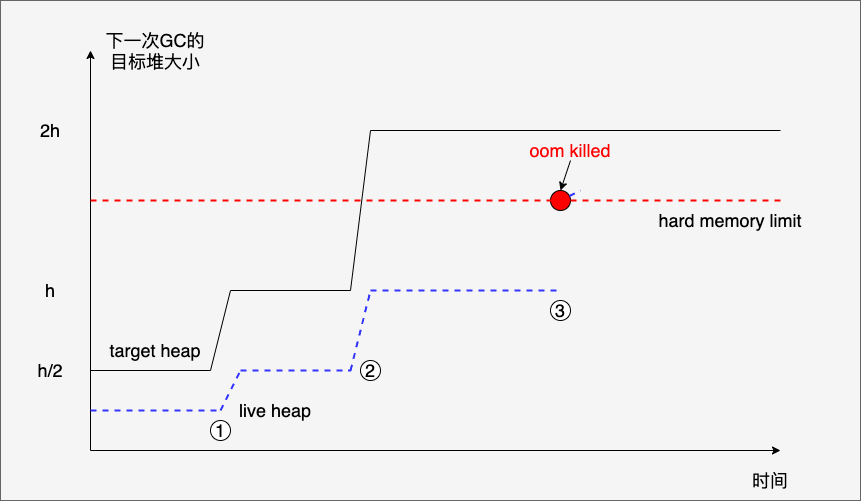
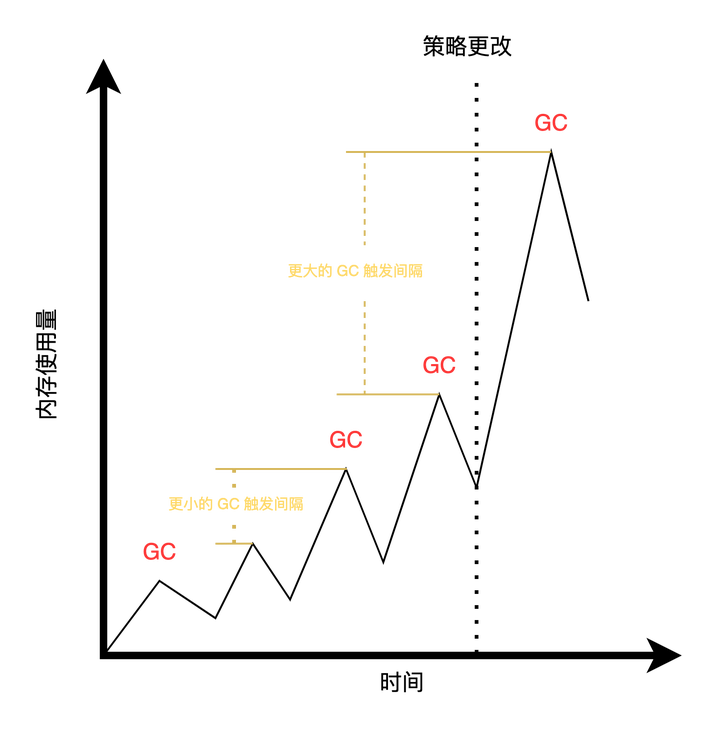
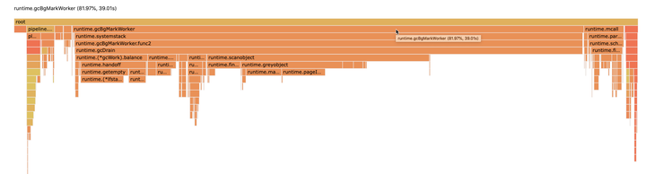
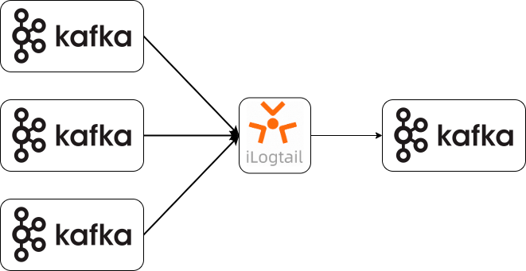

## 背景介绍

iLogtail 是阿里云日志服务（SLS）团队自研的可观测数据采集 Agent，拥有的轻量级、高性能、自动化配置等诸多生产级别特性，可以署于物理机、虚拟机、Kubernetes 等多种环境中来采集遥测数据。目前 iLogtail 已有千万级的安装量，每天采集数十 PB 的可观测数据，广泛应用于线上监控、问题分析/定位、运营分析、安全分析等多种场景，在实战中验证了其强大的性能和稳定性。

为了满足用户对于拓展性的需求，iLogtail 采用了 Go 编写插件系统。在日志采集的场景中，每一条日志都对应了插件系统中一个日志对象。这个对象的生命周期随着在读取日志时开始，在发送日志后结束。然而，再处理大量的日志时，频繁的对象创建和销毁会对 Go 垃圾回收的性能产生一定的要求。

在这篇文章中，我们将会介绍 iLogtail 中与 Go GC 相关的参数，以及如何根据不同的使用场景对这些参数进行配置。通过深入了解这些参数，用户可以更好地优化 iLogtail 的性能，提高日志采集的效率和准确性。

## Go 垃圾回收
在了解 iLogtail 对 Go GC 的管理和优化之前，我们先简单介绍一下 Go 垃圾回收的相关背景知识。

### GC 触发机制
Go 会在以下三种情况下触发垃圾回收：

1. 堆大小触发：堆内存的分配达到控制器计算的触发堆大小。触发堆大小的计算公式如下：
```
触发堆大小 = live heap + (live heap + GC roots) * GOGC / 100
```
Live heap 是上次 GC 后堆内剩余活跃的对象大小，GC roots 是栈或者常量区中的对象大小，GOGC 是 Go 1.19 之前，关于垃圾回收唯一可配置的参数，默认为 100。

2. 时间触发：如果一定时间内没有触发，就会触发新的循环，该触发条件由 runtime.forcegcperiod 变量控制，默认为 2 分钟。但这个参数并提供没有接口进行修改。

3. 手动触发：手动调用 runtime.GC。 

### Soft Memory Limit
在 Go 1.19 中，除了 GOGC 之外，新引入了 Soft Memory Limit，GOMEMLIMIT 这一参数，用于解决 OOM（Out Of Memory）的问题。
首先，我们先来看一下 Go 1.19 之前存在的问题。



上图很清楚地展示了 OOM 问题发生的场景。从下向上看，蓝色虚线表示 live heap 大小。黑色实线表示触发堆大小。红色虚线表示物理内存大小。在1、2处各发生了一次 GC，从而导致触发堆的大小增长。然而，当第二次 GC 改变触发堆大小后，就超过了实际物理内存大小。但 Go 内存管理器没有感知到这一点，仍然在不断地分配内存。直到达到 hard memory limit，导致 OOM。而在此期间由于没有达到触发堆大小（时间短的情况下，也不会触发定时GC），不会触发GC。

而 GOMEMLIMIT 的引入就相当于在上图中引入了绿色虚线。为 Go 的内存使用大小设置了一个上限，保证了 Go 的内存使用不会超过物理内存。

（下图仅为示意，GOMEMLIMIT 限制的不仅仅是堆大小，而是整个 Go 所使用的内存容量）


### GC CPU 占用控制

在 Go 1.19 之前，存在着一个问题叫作死亡螺旋（death spirals）。GC 回收器会临时征用用户的工作 goroutine 来进行垃圾回收的工作。当堆越大，GC 需要扫描的空间也就越大，消耗的 CPU 时间也越大。用户工作 goroutine 的 CPU 时间就越少，堆内的对象就一直不会被处理完，无法释放。最终，GC 可能会持续一直的运行。

为了避免死亡螺旋，Go 1.19 采用了 leaky bucket，对 GC 所能够使用的 CPU 时间进行限制。


算法实现了一个抽象的桶。当发生 GC 时，会向桶内增加 GC 所耗费的 CPU 时间。而当执行用户任务时，则会从桶中抽出时间。当桶内的水位达到一定阈值后，就会阻止 GC 征用用户 goroutine 来辅助 GC。该功能的作者将 GC 可使用的 CPU 时间占比（桶的水位）设置为了 50%。这避免了频繁 GC 导致的问题。但同时，由于 GC 次数会被强制降速（不能征用用户 goroutine 来辅助了），所以在快到达 soft memory limit 时，有可能稍微超出。

## iLogtail 插件启动策略

在 Go 1.19 前，为了更加精细地管理 Go 内存使用情况，iLogtail 对于启动或者重启时需要处理大量堆积的历史日志的场景，设计了特殊的内存管理策略，避免启动时对内存造成很大的压力。iLogtail 的插件系统启动策略可以概括为以下两个阶段：

1. 启动阶段：设置触发堆的增长大小 GOGC 为较小的值，更加频繁地触发 GC（避免内存激增、避免 OOM）
2. 正常阶段：启动一段时间后，恢复触发堆的增长大小为默认设置



然而，这个方法并不是完美的，在 iLogtail 升级 Go 1.19 之前仍然存在着以下两个问题：

1. 在启动阶段，通过更频繁的 GC 只能尽可能地缓解插件系统的内存使用量，并不能 100% 保证不出现 OOM 的情况。
2. 在保证内存使用量（避免 OOM）的情况下，无法优化 GC 所占用的 CPU 时间。无论在启动或是正常运行阶段，如果为了通过减小 GC 触发堆的增长来避免 OOM，就很容易导致 GC 次数过于频繁，占用大量的 CPU 时间。

## 升级方案
为了优化以上两个问题，iLogtail 从 1.6.0 版本开始，升级支持了 Go 1.19，并向用户提供了 4个与 Go GC 相关的参数，其中两个为 Go 环境变量，两个为 iLogtail 环境变量。

### GOGC
GOGC 为 Go 原生的环境变量，也是在 Go 1.19 之前唯一可以对 Go GC 进行修改的参数。对于 iLogtail，该参数的作用是控制启动结束，策略更改后 GC 的触发堆增长大小。

默认值为 100。

### GOMEMLIMIT
GOMEMLIMIT 为 Go 原生的环境变量，在 Go 1.19 加入。对于 iLogtail，该参数的作用是控制 Go 所能使用的内存上限。

默认值为无限制。

### ALIYUN_LOGTAIL_GOLANG_GC_PERCENT
ALIYUN_LOGTAIL_GOLANG_GC_PERCENT 为 iLogtail 自身的环境变量。该参数的作用是控制 iLogtail 在启动初始阶段，策略更改前 GC 的触发堆增长大小。

默认值为 20。

### ALIYUN_LOGTAIL_GOLANG_GC_PERCENT_RESUME_SEC
ALIYUN_LOGTAIL_GOLANG_GC_PERCENT_RESUME_SEC 为 iLogtail 自身的环境变量。该参数的作用是控制 iLogtail 启动初始阶段的时间长度。

默认为 5 分钟，单位为秒。

## 具体场景与方案建议
本章节结合了刚才所提到的现有启动策略中的两个问题，提出了如何通过配置以上的 4 个参数实现对 GC 优化。有些特殊的 iLogtail 使用场景没有办法统一处理，可以参考下文场景中的优化思路。

### 场景一：启动时处理历史日志导致 OOM
#### 问题描述
在 iLogtail 启动或者重启时，有可能需要处理大量累积的历史日志。iLogtail 的内存使用率会出现显著的升高，甚至超出物理内存大小，导致 OOM。

#### 问题原因
一部分原因是因为短时间内处理大量的日志，Go 插件中创建了大量的对象，内存使用量升高。另一部分原因是 Go 的内存管理器无法感知物理内存的上限，会无限扩充可使用的堆的大小。

#### 解决方案
在这种场景下，配置 GOMEMLIMIT 即可解决。

但 iLogtail 作为一个日志采集工具，往往与其他程序共享计算机资源，在很多场景下，用户可能比较难配置一个明确的内存使用上限。这种情况下，可以使用 iLogtail 现有的插件系统启动策略，设置 ALIYUN_LOGTAIL_GOLANG_GC_PERCENT 为较小的值。通过牺牲短时间内的 CPU 使用率，换取 iLogtail 的平滑启动。

### 场景二：GC 占用 CPU 时间过多
#### 问题描述
客户在使用 iLogtail 采集日志，向 Kafka 发送时，发现性能出现了比较严重的下降。通过 Go pprof 进行分析发现，Go GC （runtime.gcBgMarkWorker）占用了大量的CPU，阻塞了正常的日志处理。



#### 问题原因
在 iLogtail 中，每一条日志都对应了一个 Log 对象。这个对象的生命周期其实特别短，从 input 创建，到 processor，最终 flusher 发送后，这个对象就被释放了。

对于 50,000 条日志每秒的日志处理来说，那么一秒钟就涉及到了 50,000 * 2 次的对象创建和释放。假设每个对象 1KB，那么每秒就需要申请并释放大概 50MB 内存。

#### 解决方案
在配置了 GOMEMLIMIT 的情况下，如果关闭了触发堆 GC，即 GOGC=off，就只会在内存到达 GOMEMLIMIT 时，才会触发 GC，就可以大大的减少 GC 的次数。

所以，可以配置以下的优化方案：

- 限制 GOMEMLIMIT
    - 如果对于内存的使用量有一定要求，则同时配置 GOGC 为一个较大的值，例如 200、300。减少 GC 的触发频次。
    - 如果对于内存的使用量没有限制，则同时配置 GOGC 为 off

### 场景三：日志中转服务
#### 问题描述
用户使用 iLogtail 作为日志中转处理服务，从一个 Kafka 中读取日志，经过 iLogtail 简单处理后，发送到另一个 Kafka 中进行存储。在这个场景下，用户不需要处理历史累积的日志，更加需要 iLogtail 启动后可以更快的提供高性能的服务。



#### 问题原因
iLogtail 默认的启动策略导致插件系统在启动时，会牺牲一定的 CPU 时间来换取内存安全。所以，会导致其在 iLogtail 刚启动的一小段时间内无法发挥全部的性能，提供最高效的服务。

#### 解决方案
这种情况下，需要关闭 iLogtail 的默认启动策略。可以将 ALIYUN_LOGTAIL_GOLANG_GC_PERCENT_RESUME_SEC 配置为 0，即在一开始就立刻进入正常运行的 GC 处理策略。

### GOMEMLIMIT 与 GOGC 配置建议
- 在配置 GOMEMLIMIT 时，需要注意 iLogtail 自身的内存使用参数 memory_usage_up_limit。该参数同时限制了 C++ 程序和 Go 插件系统总体的内存使用量，默认为 2GB。如果使用量超出该限制，会导致 iLogtail 发生重启。因此，GOMEMLIMIT 的值应当低于 memory_usage_up_limit。
- 配置 GOGC=off 但不设置 GOMEMLIMIT 会导致 Go 插件系统中只有定时 GC，不推荐进行这样的配置。
- GOMEMLIMIT 设置了 Go 插件系统可使用的内存上限。但需要注意的是，Go 并不保证所使用的内存一定低于该上限。在 GC 发生拥塞的情况下，有可能由于垃圾回收不及时，导致使用量稍微超出该上限。所以，推荐将 GOMEMLIMIT 设为 Go 可使用内存上限的 95% ~ 96%。
- 当无法确定与 iLogtail 在相同环境下运行的其他程序的内存使用大小时，不推荐将 GOGC 设置为 off，因为会导致 iLogtail 插件占用大量无效内存却不释放。如果这种情况下出现 GC 频繁的问题，推荐将 GOGC 设置为一个较大的值。

## 参考资料
1. https://github.com/golang/proposal/blob/master/design/48409-soft-memory-limit.md
2. https://github.com/golang/go/issues/48409
3. https://netflixtechblog.medium.com