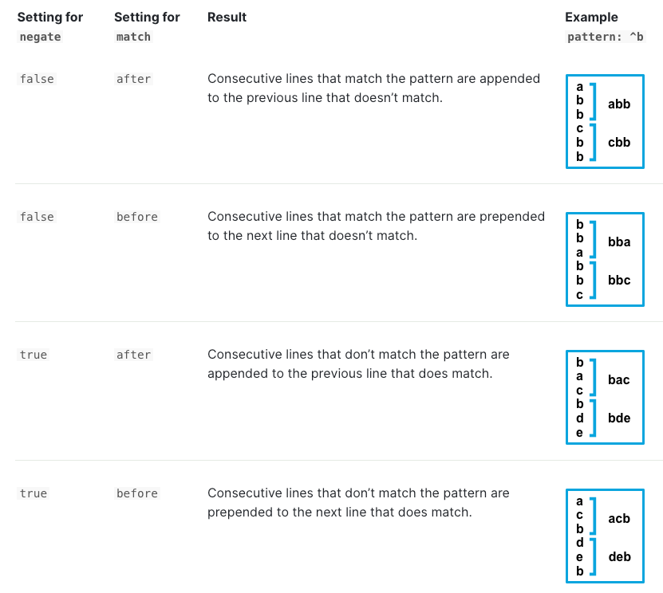

## 功能对比

|                     | Filebeat | Fluent Bit | Vector |
| ------------------- | -------- | ---------- | ------ |
| 正则                  | Y        | Y          | Y      |
| 多种方式处理非匹配行          | Y        | Y          | Y      |
| 多种方式聚合日志            | Y        |            |        |
| 匹配到pattern时自动flush | Y        |            |        |
| 日志达到一定数量自动flush | Y        |            |        |
| 最大行数                | Y        |            |        |
| 超时自动flush           | Y        | Y          | Y      |
| 日志之间插入换行         | Y        |            |        |
| 内置模板                |          | Y          |        |
| 聚合前解析结构           |          | Y          |        |

总结：

1. 从功能方面，Filebeat 所支持的功能最多，其次是 Fluent Bit。
2. 从配置方面，Filebeat 通过 `negate` 和 `match` 两个字段的排列组合简化了配置，但对于用户有一定理解成本。而 Fluent Bit 所提供的基于状态的配置比较清晰易懂，但会导致配置文件结构复杂。
3. 从实现方面，前三者都采用了维护一个 buffer 的形式。

## Filebeat


### 文档

链接：[https://www.elastic.co/guide/en/beats/filebeat/current/multiline-examples.html](https://www.elastic.co/guide/en/beats/filebeat/current/multiline-examples.html)

**支持功能：**

1. 多种方式聚合多行日志，例如，pattern，count，while_pattern

2. 正则匹配

3. 多种方式处理非匹配行
   
    个人理解：negate 相当于是区分判断 event 的主体是`匹配行`还是`非匹配行`。match 相当于是控制多行日志中的其他行附着到哪个主体（前or后）上。



1. 匹配到指定 pattern 时进行 flush
2. 指定数量的日志聚合成一个 event
3. 一个event最大行数
4. 超时自动flush
5. 多个event之间换行

**样例：**

```cpp
parsers:
- multiline:
    type: pattern
    pattern: '^[[:space:]]'
    negate: false
    match: after

以下的 log 会被解析成一条：
Exception in thread "main" java.lang.NullPointerException
        at com.example.myproject.Book.getTitle(Book.java:16)
        at com.example.myproject.Author.getBookTitles(Author.java:25)
        at com.example.myproject.Bootstrap.main(Bootstrap.java:14)
```

**解释：**这里pattern匹配的是前面带有空格的行，因此，多行的开始`Exception`属于不匹配行。由于 negate 为 false，所以作为 event 的主体。后续匹配的`at`会聚合成一个事件。

### 实现

链接：[https://github.com/elastic/beats](https://github.com/elastic/beats)


Filebeat (libbeat) 在 reader 模块实现了 multiline 的功能。

1. 根据配置项，在创建 parser 时，创建了 multiline 的 parser（reader）。根据不同的聚合模式，这里就会创建不同的 reader。
2. 在处理日志时，会不断地调用 Next 方法。
3. Next 方法中的 state 函数，会根据当前的匹配状态（是否匹配了第一行）执行不同的逻辑。
4. 如果没有 buffer 为空，则 readFirst 中会在 Message Buffer 中创建一个新的 Message。然后进入 readNext 逻辑。
5. readNext 中会不断从 file 的 reader 中读取日志，并添加到 Message Buffer 中。直至两种情况下，flush 日志，并将 state 重置为 readFirst：
   1. 匹配到强制 flush 的 pattern
   2. 根据 `negate` 和 `match` 无法匹配成一条 message

## Fluent Bit


### 文档

链接：[https://docs.fluentbit.io/manual/administration/configuring-fluent-bit/multiline-parsing](https://docs.fluentbit.io/manual/administration/configuring-fluent-bit/multiline-parsing)

**支持功能：**

1. 内置多种类型日志的多行解析：docker，cri，go，python 和 java
2. 正则匹配
3. 支持匹配前解析，将文本解析成结构体
4. 支持对结构体指定字段进行匹配
5. 超时自动flush

fluent bit 将多行匹配问题，建模成了一个状态机。每一条规则包含三个部分：

1. state name：一个multiline log的开始状态（start_state），还是继续状态（cont）
2. 正则表达式
3. next state：这个状态后可能是什么状态

**样例：**

```
# fluent bit 配置
[SERVICE]
    flush        1
    log_level    info
    parsers_file parsers_multiline.conf # 指定了 multiline 的规则

[INPUT]
    name             tail
    path             test.log
    read_from_head   true
    multiline.parser multiline-regex-test # 指定了 multiline 的 parser

[OUTPUT]
    name             stdout
    match            *

# multiline 的规则
[MULTILINE_PARSER]
    name          multiline-regex-test
    type          regex
    flush_timeout 1000
    #
    # Regex rules for multiline parsing
    # ---------------------------------
    #
    # configuration hints:
    #
    #  - first state always has the name: start_state
    #  - every field in the rule must be inside double quotes
    #
    # rules |   state name  | regex pattern                  | next state
    # ------|---------------|--------------------------------------------
    rule      "start_state"   "/([a-zA-Z]+ \d+ \d+\:\d+\:\d+)(.*)/"  "cont"
    rule      "cont"          "/^\s+at.*/"                     "cont"

# 可以被解析的规则
Dec 14 06:41:08 Exception in thread "main" java.lang.RuntimeException: Something has gone wrong, aborting!
    at com.myproject.module.MyProject.badMethod(MyProject.java:22)
    at com.myproject.module.MyProject.oneMoreMethod(MyProject.java:18)
    at com.myproject.module.MyProject.anotherMethod(MyProject.java:14)
    at com.myproject.module.MyProject.someMethod(MyProject.java:10)
    at com.myproject.module.MyProject.main(MyProject.java:6)
```

**解释：**start_state 是以时间格式的正则匹配的，匹配到后，进入第二条 rule（以at开头）。然后不断匹配，直到遇到某一行可以被 start_state 所匹配。

### 实现

**链接：**[https://github.com/fluent/fluent-bit/tree/master/src/multiline](https://github.com/fluent/fluent-bit/tree/master/src/multiline)


Fluent bit 从 v1.8 开始，就开始在 core 中支持了 multiline。为了兼容之前版本，依然保留了以插件的形式支持。

1. 在初始化时，会自动将所有 built-in 的 parser 加入了 context 的 multiline_parsers 链表中。
2. 接下来，会根据用户的配置，创建用户自定义的 parser，同样加入到链表中。这里 fluent bit 还做了一点优化，会维护一个 lru_parser，优先尝试使用上次的 parser 进行解析，避免对 multiline_parsers 进行查找。
3. 经过一系列调用后，核心的处理逻辑位于函数 flb_ml_rule_process 中。
4. 首先，会使用 start_state 的 rule 进行匹配。如果成功，则后续不断使用 cont 的 rule 进行匹配，并将日志加入到 buf 中。
5. 在两种情况下，可能发生 flush，并回到 start_state 状态：
   1. 匹配的 rule 的后续状态为 start_state
   2. 当前日志被 start_state 的 rule 匹配

## Vector


### 文档

**链接：**[https://vector.dev/docs/reference/configuration/sources/file/#multiline](https://vector.dev/docs/reference/configuration/sources/file/#multiline)

Vector 将多行日志的处理理解成了一种聚合方式。

**支持功能：**

1. 正则匹配
2. 多种方式处理非匹配行
3. 超时自动flush

**样例：**

```
# vector 配置
[sources.my_file_source]
  type = "file"

  [sources.my_file_source.multiline]
    start_pattern = "^[^\\s]"
    mode = "continue_through"
    condition_pattern = "^[\\s]+from"
    timeout_ms = 1000

# 可以被解析的日志
foobar.rb:6:in `/': divided by 0 (ZeroDivisionError)
  from foobar.rb:6:in `bar'
  from foobar.rb:2:in `foo'
  from foobar.rb:9:in `<main>'
```

**解释：任何非空白开头的日志会被当做一个event的开始。然后匹配到 from 后，会根据 mode: continue_through 继续匹配。**

### 实现

**链接：**[https://github.com/vectordotdev/vector/blob/master/src/line_agg.rs](https://github.com/vectordotdev/vector/blob/master/src/line_agg.rs)


1. Vector 中的多行处理是通过 LineAgg 类实现。
2. 在处理日志时，会不断地调用其 poll_next 方法。该方法中，会不断地读取日志，并根据 inner 读取的结果进行不同的处理。
3. 如果是 pending 状态，即没有新的日志需要处理。则会从 self.timeouts (实现上是一个 delayQueue）中去 flush 过期的日志。
4. 如果是 ready 状态，则处理新的日志。如果当前 buffer 为空，则直接 insert。同时 insert 进 timeout。
5. 如果当前 buffer 不为空，则根据配置采用不同的规则进行处理（add_next_line 或者 flush）。
